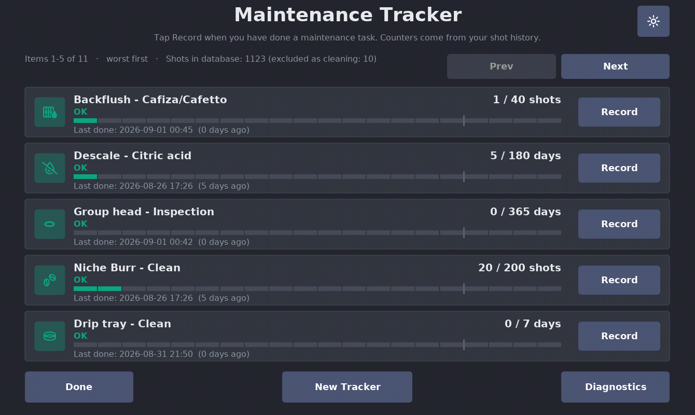

# Maintenance Tracker

A DE1app plugin that tracks espresso machine and grinder maintenance:
backflush, descale, group gasket replacement, burr cleaning, burr
installation (with a pre-history shot-count offset), water filter
changes, **water bottle level** (how much is left in the supply bottle,
measured from the machine's own dispense reports) — plus your own
**custom trackers** (a second grinder, a water tank clean, anything)
with their own name, unit and threshold.

Author: **Blastize** · Current version: **0.19.1** (Pass 20)



## What it will do (target design)

- You record each maintenance event with one tap; the plugin stores only a
  timestamp and an optional note **in its own settings file**.
- Counters are derived by combining those timestamps with **read-only**
  queries against the SDB shot database: "N shots since X" and
  "N days since X".
- A silent status page shows green / amber / red per item — no automatic
  popups (the after-shot popup slot belongs to GrindAdvisor).
- A small public API (`status_summary`, `open_page`) lets the Lumen skin
  show a notification dot near a maintenance icon.

## What it does right now (v0.19.0 — Pass 20)

- **Dark mode**: a sun/moon button in the main page's top-right corner
  switches the whole plugin between light and dark instantly — every
  page repaints on the spot, and the choice is remembered across
  restarts. Buttons darken with the theme (v0.19.1); state colors
  (green/amber/red) and the red danger buttons are the same in both.

- **One consolidated tracker model**: every tracker — built-in or
  custom — can be **edited** (name, threshold, icon; the counting unit
  stays locked so history keeps meaning what it meant) and **hidden**
  (at most 6 at once, matching the 6 restore chips on the New Tracker
  page; the Hide button disables with an explanation at the cap).
  Built-ins cannot be deleted — hiding is their reversible retirement,
  which protects the auto-record, burr-offset and water-meter wiring —
  while custom trackers delete from the bottom of their **Edit** page
  behind the same two-step "Yes, Delete Tracker" confirm.
- **A written button standard** (see the implementation header) now
  governs every page: bottom-left is always safe navigation
  (Done / Back / Cancel — and while a destructive confirm is armed, it
  disarms first); bottom-right is the page's one positive action
  (Save / Confirm); destructive actions (Undo, Delete) are red,
  two-step with explicit "Yes, …" labels, and separated from safe
  buttons by at least a button-width of empty space; Edit sits in the
  Detail page's top-right header slot; Prev/Next are paired top-right
  and disable at the ends. Buttons wear text labels, not icons.

- **Water bottle tracking in millilitres**: the machine reports how much
  water every operation dispenses (espresso, steam, hot water, flushes,
  clean and descale cycles); the plugin accumulates this into a lifetime
  water meter whenever an operation completes. The built-in **Water
  bottle** tracker counts that meter against the bottle size (default
  18.9 L = 5 US gal): its card shows "used / size" in litres, **"About
  X L left"**, and the wear bar fills as the bottle empties. Tap Record
  when you attach a fresh bottle — the confirm page also carries
  ±100/±1000 ml steppers to adjust the bottle size, and Undo restores
  the previous bottle's baseline. The meter only runs while the app is
  running (which commands every flow, so in practice that is complete),
  and it is the machine's flow *estimate* — expect a few percent drift,
  so treat "due soon" (80%) as the swap signal. Custom trackers can also
  pick the **ml** unit, e.g. a water filter tracked by real throughput.
- **"Service Bay" cards**: every tracker card shows a state-tinted icon
  plate (glyphs from the Font Awesome 6 Pro font the app already
  ships), the state word in color, a right-aligned counter, a segmented
  wear bar with a tick at the amber threshold, and the last-done date.
  The list sorts **worst first** (overdue → due soon → OK → never
  recorded), so what needs attention is always on page one.
- **Icon picker**: when adding (or editing) a tracker you pick its icon
  from **two rows of twelve** — wrench, hot mug, beans, filter,
  droplet, drip-tray grate, O-ring, steam wand, faucet, water tank,
  stopwatch, spray can / water bottle, drain pipe, ball joint, pressure
  gauge, scale, thermometer, gears, flat gasket, descale, calendar
  check, bell, star. Two of these — the **steam wand** (a spout
  blasting steam) and the **flat gasket** (the O-ring squashed flat) —
  are not font glyphs at all: the FA font has no honest version of
  either, so the plugin draws them itself as stroke graphics that
  recolor with the state tint like every other icon. The "Icon:" line
  names the current selection (e.g. "Icon:  Steam wand") so every pick
  has a meaning, not just a shape. A tracker whose
  stored icon is no longer offered keeps rendering it, and editing
  such a tracker never swaps the icon unless you pick a new one.
- **Detail page icon**: opening a tracker shows its icon top-left on a
  state-tinted plate, matching its card.
- **Hide / restore trackers**: every tracker's Detail page has a Hide
  Tracker button — hiding removes it from the card list and the status
  rollup (it can no longer light the skin's dot) while keeping all its
  data. The New Tracker page shows one chip per hidden tracker — tap a
  chip to restore just that one. At most 6 trackers can be hidden at
  once. **Burr install starts hidden** (burrs last ~30k shots — not a
  routine maintenance item; restore it if you want it back).
- **Edit any tracker**: the Edit button on every Detail page changes
  the tracker's name, threshold and icon — the history and the
  counting unit (days, shots or ml) stay as they are. Custom trackers
  additionally have Delete Tracker at the bottom of their Edit page
  (two-tap confirm).
- **Custom trackers**: the New Tracker button (bottom center of the
  main page) creates your own named tracker — e.g. "Grinder 2 burr
  clean" — counting days, shots or ml against a threshold you set with
  stepper buttons. Custom trackers appear as cards after the built-ins
  and use the exact same Record / history / Undo flows, and they feed
  the Lumen notification dot like every other item. They are
  manual-record only. Built-in items can never be deleted. **Note:** a
  shot-based custom tracker counts *every* shot on the machine — the
  shot database cannot tell which grinder pulled which shot — so
  prefer days for gear that does not see every shot.
- **Auto-recording**: running the machine's own Clean or Descale program
  records the matching maintenance event automatically once the cycle
  completes (aborted cycles are ignored via duration thresholds), and a
  blind-basket backflush run as a "cleaning" espresso profile records a
  backflush. Auto events appear in the Detail page history as "recorded
  automatically" and can be undone exactly like manual ones. Turn the
  whole feature off with the `auto_record` setting; thresholds are
  tunable in settings and shown on Diagnostics.

- Every maintenance item keeps an **append-only event log** (newest 20
  kept). Recording appends an event; the familiar `last_done` is derived
  from the log, so all counters behave exactly as before. Settings from
  v0.4.x migrate automatically the first time v0.5.0 loads.
- **Tapping a card's text area** (anywhere left of its Record button)
  opens a per-item **Detail page**: current state and counter, the 5
  newest events with date and how they were recorded, and — when at
  least one event exists — an **Undo Last Record** button (red). Undo
  asks for confirmation on the same page, showing exactly which record
  will be removed and what the counter falls back to; confirming pops
  just that one event and returns to the card list.

- Appears in Settings → App → Extensions as "Maintenance Tracker".
- The main page is a **card list** (5 cards per page, Prev/Next paging):
  one card per maintenance item with a green/amber/red state dot (grey =
  never recorded), the current count ("12 of 30 shots since last done" /
  "41 of 90 days"), the last-done date, and a **Record** button.
- **Record** opens a confirmation page ("Record X as done now?" with the
  current counter shown); Confirm sets the item's last-done time to now
  and restarts its counter, Cancel changes nothing. **Burr install** has
  its own confirmation page with a "shots already on these burrs" offset
  entered via −100/−10/+10/+100 stepper buttons (no on-screen keyboard).
- A **Diagnostics** page shows everything detected: database path, open
  status, detected table and columns, raw/counted/excluded row counts,
  whether the cleaning filter is active, and the exclusion keyword lists.
  Back returns to the settings page.
- The count SQL avoids SQLite's `lower()` entirely (this tablet's
  AndroWish SQLite fails it with an ICU link error; `LIKE` is already
  case-insensitive for ASCII), and if the exclusion filter ever fails,
  counting falls back to unfiltered rows instead of going dark — flagged
  on Diagnostics.
- `::plugins::MaintenanceTracker::status_summary` is real: it returns
  `ok 1`, the overall worst state (`ok`/`amber`/`red`), and a per-item
  dict (state, value, threshold, unit, days_since, shots_since). Results
  are cached; the cache is invalidated silently after each completed
  flow and by a 10-minute TTL, so fast skin polling never hits the
  database. Day-based items keep working even if the database is
  unavailable (shot-based items report `unknown`).
- Counting rules: **raw** shot-table rows (soft-deleted/archived shots
  still count — they physically ran), minus a defensive exclusion of
  cleaning-type rows (`beverage_type` in cleaning/calibration/test/
  testing, or `profile_title` containing rinse/flush/backflush/clean/
  descale/calibrat), applied only to columns that actually exist.
- Table and columns are detected dynamically (ordered regex patterns,
  GrindAdvisor mechanism) — no fixed schema is assumed.

## Safety

- **SDB access is strictly read-only**: the plugin opens its own sqlite3
  handle with `-readonly true` and the only SQL shape it ever issues is
  `SELECT COUNT(...)` (plus schema inspection via `sqlite_master` /
  `PRAGMA table_info`). It never reuses or blocks the app's own handle.
- **History files (`history/`, `history_v2/`) are never touched by this
  plugin, in this or any future version.**
- No popups, no automatic UI. The single registered event listener
  (`after_flow_complete`) only marks the internal counter cache stale.
- The only file written is the plugin's own
  `plugins/MaintenanceTracker/settings.tdb`, via `plugins save_settings` —
  after an explicit user tap (Confirm, Confirm Undo, Add Tracker, or the
  two-tap Delete Tracker), one auto event per completed real
  clean/descale cycle, or (v0.13.0) the water-meter update when a
  flow/cycle completes. Undo removes only the single newest record.
  Deleting is possible **only for custom trackers you created**, needs
  two taps, and the removed tracker is kept in the settings file under
  `last_deleted_custom` so a mistake is recoverable. There is no bulk
  delete or reset anywhere.

## Install

Copy the folder to the tablet as:

```text
de1plus/plugins/MaintenanceTracker/
```

(never nested as `MaintenanceTracker/MaintenanceTracker/`), then restart
the DE1app by hand and enable it under Settings → App → Extensions.

## Files

- `plugin.tcl` — manifest: metadata, settings defaults, framework hooks.
- `MaintenanceTracker.tcl` — implementation: layout tokens, navigation,
  settings page, public API.
- `filelist.txt`, `README.md`, `CHANGELOG.md`, `PROJECT_STATE.md` — docs.
- `settings.tdb` — created at runtime by the app; not part of the package.
